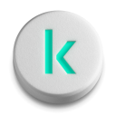

 
 
 # Kaspirin Documentation

This documentation provides a brief overview of the key functionality provided by the Kaspirin platform, which consists of the following projects:

* Kaspirin.UI.Framework
* Kaspirin.UI.Framework.UiKit
* Kaspirin.UI.Framework.UiKit.Media
* Kaspirin.UI.Framework.UiKit.Styles
* Kaspirin.UI.Framework.UiKit.Translator.Core
* Kaspirin.UI.Framework.UiKit.Translator.Launcher

Kaspirin is an extension of the WPF platform, so all solutions implemented in Kaspirin will also work in other WPF projects.

## Kaspirin.UI.Framework

Kaspirin.UI.Framework is a set of basic services and tools designed to help developers create high-quality, maintainable, and efficient applications with a user interface or console applications.

### Key Features
* Custom IoC container implementation
* Basic classes for implementing the MVVM approach
* Services for organizing logging in the application
* A wide range of protective methods (Guards) for data validation
* Various tools for working with multithreading
* A set of convenient extension methods for working with collections, dictionaries, strings, and other data types

## Kaspirin.UI.Framework.UiKit

Kaspirin.UI.Framework.UiKit provides a large set of ready-to-use tools that allow you to solve typical problems that developers face when creating a user interface for OS Windows applications.

### Key Features

* Custom system for organizing UI element styles, separating style into two components: a common template and a visual component loaded from Figma
* A large set of custom UI elements, converters, and other tools that simplify the development of the user interface
* Convenient localization system that works with over 30 languages
* Built-in support for light and dark themes
* Tools for working with animations

## Kaspirin.UI.Framework.UiKit.Styles and Kaspirin.UI.Framework.UiKit.Media

These assemblies consist mainly of auto-generated files created during the style translation procedure from Figma.

* Kaspirin.UI.Framework.UiKit.Media contains examples of SVG illustrations (a set for light and dark themes) and auxiliary tools for their use in XAML.
* Kaspirin.UI.Framework.UiKit.Styles contains generated styles for UI elements, describing the visual component, as well as a palette and a set of text styles.

## Kaspirin.UI.Framework.UiKit.Translator.Core and Kaspirin.UI.Framework.UiKit.Translator.Launcher

These assemblies provide one of the key features of Kaspirin - translation of styles loaded from Figma into XAML format. This style translation mechanism allows you to create and configure the visual representation of UI elements in Figma and then use it in your application.

### What can be converted from Figma

* Figma UI component styles (element colors in different states, margins, sizes, etc.)
* Icons and illustrations in SVG format
* Palette for light and dark themes
* A set of test styles

Figma plugin that performs page parsing will be published at a later date.

Currently, the resulting file UI_KIT.xml is available, which demonstrates all the data loaded from Figma.

## Getting Started

To get started with Kaspirin, you need to:

1. Create a new WPF Application project;
2. Add references to packages:
    * Kaspirin.UI.Framework
    * Kaspirin.UI.Framework.UiKit
    * Kaspirin.UI.Framework.UiKit.Styles
    * Kaspirin.UI.Framework.UiKit.Media;
3. Add to Application.Resources:
    * a link to the Visuals.xaml dictionary from Kaspirin.UI.Framework.UiKit.Styles
4. Add to the application initialization code the following steps:
    * Initialization of logging
    * Initialization of the container
    * Initialization of the localization manager

## Releases

Currently we expect that the project will be regularly updated with new functionality and improvements that we would like to share with you. Also, it is possible that some functionality may be removed from the project over time. Therefore, we cannot guarantee full backward compatibility of new Kaspirin releases with previous ones.

## Contribution

This is an open source project. If you are interested in making a code contribution, please see [CONTRIBUTING.md](CONTRIBUTING.md) for more information.

## License

Copyright © 2024 AO Kaspersky Lab
Licensed under the Apache 2.0 License. See the [LICENSE.txt](LICENSE.txt) file in the root directory for details.